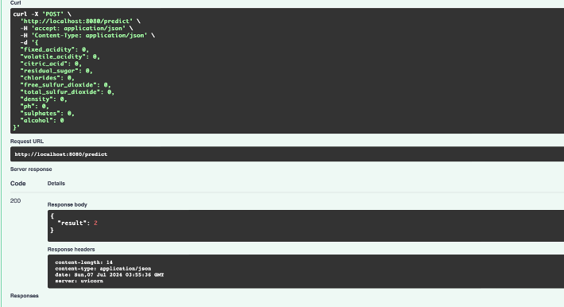

# About:
### This repo contains source code and slides demonstrating the usage of Snowflake as both as data store for ML
### and as a platform for ML. 
###
### The wine library shows e2e model dev and deployment using Snowflakes Model repo and pipelines. The song_gen library 
### shows how to embed and generate data based on data within Snowflake. The data in the song_gen library is copyright
### the respective artist and is for demonstration purposes only. 

## Usage (Wine Quality Classifier):
## Load environment variables
### 1) Copy env.bash.example to env.bash and fill in your details. 
### 2) Copy lib/utils/.env.example to lib/utils/.env and fill in your details.
### 3) Execute env.bash in terminal or paste into ~/.bashrc.

## Run container:
### 4) Navigate to docker folder and execute: run_docker.bash
### 5) Navigate to localhost:8080/docs

## Usage (Song Writing App):
## Load environment variables
### 1) Copy env.bash.example to env.bash and fill in your details. 
### 2) Copy lib/utils/.env.example to lib/utils/.env and fill in your details.
### 3) Execute env.bash in terminal or paste into ~/.bashrc.

## Run container:
### 4) Navigate to lib/song_gen
### 5) Execute streamlit run streamlit_app.py
### 6) Navigate to: localhost:8501
